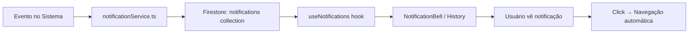

# 🔔 Sistema de Notificações - Guia Completo

## ✅ Arquitetura 100% Centralizada

O sistema de notificações foi refatorado para ser **completamente centralizado e genérico**. Adicionar novos tipos de notificação agora requer apenas **3 passos simples**.

---

## 📁 Estrutura do Sistema

```
src/
├── config/
│   └── notificationConfig.ts          ← CONFIGURAÇÃO CENTRAL (adicionar novos tipos aqui)
├── types/
│   └── index.ts                        ← Enum NotificationType
├── actions/
│   └── notificationService.ts          ← Funções server-side para criar notificações
├── hooks/
│   └── useNotifications.ts             ← Hook reusável para buscar notificações
└── components/
    └── shared/
        ├── NotificationBell.tsx        ← Sino de notificações (100% genérico)
        └── NotificationHistory.tsx     ← Histórico de notificações (100% genérico)
```

---

## 🚀 Como Adicionar uma Nova Notificação

### Passo 1: Adicionar o Tipo no Enum

**Arquivo**: `src/types/index.ts`

```typescript
export type NotificationType =
  | 'brand_approval_pending'
  | 'brand_approval_approved'
  | 'brand_approval_rejected'
  | 'quantity_variation_detected'
  | 'quotation_started'
  | 'quotation_closed'
  | 'offer_received'
  | 'offer_outbid'
  | 'deadline_approaching'
  | 'system_message'
  | 'SEU_NOVO_TIPO_AQUI';  // ← Adicione aqui
```

### Passo 2: Configurar o Tipo

**Arquivo**: `src/config/notificationConfig.ts`

```typescript
export const NOTIFICATION_CONFIG: Record<NotificationType, NotificationTypeConfig> = {
  // ... tipos existentes ...

  SEU_NOVO_TIPO_AQUI: {
    label: 'Rótulo Amigável',
    icon: IconeDoLucide,
    colorClasses: 'text-blue-600 bg-blue-100',
    context: 'buyer', // ou 'supplier' ou 'both'
    defaultPriority: 'high',
    defaultActionUrl: '/rota/especifica?param={quotationId}',
    description: 'Descrição do que esta notificação significa'
  },
};
```

**Propriedades da Configuração:**

| Propriedade | Tipo | Descrição |
|------------|------|-----------|
| `label` | `string` | Nome exibido ao usuário |
| `icon` | `LucideIcon` | Ícone do Lucide React |
| `colorClasses` | `string` | Classes Tailwind para cor (texto + fundo) |
| `context` | `'buyer' \| 'supplier' \| 'both'` | Quem deve ver esta notificação |
| `defaultPriority` | `'low' \| 'medium' \| 'high'` | Prioridade padrão |
| `defaultActionUrl` | `string` | URL de destino (use `{quotationId}`, `{productId}`, etc. como placeholders) |
| `description` | `string` | Documentação interna |

### Passo 3: Criar Função Helper (Opcional)

**Arquivo**: `src/actions/notificationService.ts`

```typescript
export async function notifySeuNovoTipo(params: {
  userId: string;
  quotationId: string;
  // ... outros params necessários
}) {
  return createNotification({
    userId: params.userId,
    type: 'SEU_NOVO_TIPO_AQUI',
    title: 'Título da Notificação',
    message: 'Mensagem detalhada',
    quotationId: params.quotationId,
    priority: 'high',
    metadata: {
      // dados extras opcionais
    }
  });
}
```

---

## ✨ Pronto! Os Componentes se Adaptam Automaticamente

Após adicionar a configuração:

- ✅ `NotificationBell` automaticamente mostra o novo tipo
- ✅ `NotificationHistory` automaticamente lista o novo tipo
- ✅ Ícone, cor e rótulo são aplicados automaticamente
- ✅ Navegação para a URL funciona automaticamente
- ✅ Filtros incluem o novo tipo automaticamente

**Nenhuma modificação nos componentes UI é necessária!**

---

## 📖 Tipos de Notificação Existentes

### Aprovação de Marcas

| Tipo | Contexto | Quando Acontece |
|------|----------|-----------------|
| `brand_approval_pending` | Comprador | Fornecedor sugere nova marca |
| `brand_approval_approved` | Fornecedor | Comprador aprova marca sugerida |
| `brand_approval_rejected` | Fornecedor | Comprador rejeita marca sugerida |

### Variações de Quantidade

| Tipo | Contexto | Quando Acontece |
|------|----------|-----------------|
| `quantity_variation_detected` | Comprador | Fornecedor oferece quantidade diferente |

### Ciclo de Vida da Cotação

| Tipo | Contexto | Quando Acontece |
|------|----------|-----------------|
| `quotation_started` | Comprador | Nova cotação criada |
| `quotation_closed` | Ambos | Cotação encerrada |
| `deadline_approaching` | Ambos | Prazo próximo do fim |

### Ofertas

| Tipo | Contexto | Quando Acontece |
|------|----------|-----------------|
| `offer_received` | Comprador | Nova oferta recebida |
| `offer_outbid` | Comprador | Oferta superada por outra |

### Sistema

| Tipo | Contexto | Quando Acontece |
|------|----------|-----------------|
| `system_message` | Ambos | Mensagem geral do sistema |

---

## 🎨 Ícones Disponíveis (Lucide React)

Alguns ícones úteis já importados no config:

```typescript
import {
  AlertCircle,    // ⚠️ Alertas
  Check,          // ✓ Aprovação
  X,              // ✗ Rejeição
  TrendingUp,     // 📈 Aumento/Crescimento
  TrendingDown,   // 📉 Diminuição/Queda
  CheckCheck,     // ✓✓ Dupla confirmação
  Package,        // 📦 Pacotes/Produtos
  Award,          // 🏆 Destaque/Vencedor
  Clock,          // ⏰ Tempo/Prazo
  MessageSquare   // 💬 Mensagens
} from 'lucide-react';
```

[Ver todos os ícones disponíveis →](https://lucide.dev/icons/)

---

## 🔧 Funcionalidades Avançadas

### Construir URLs Dinamicamente

```typescript
import { buildNotificationActionUrl } from '@/config/notificationConfig';

const url = buildNotificationActionUrl('SEU_TIPO', {
  quotationId: 'abc123',
  productId: 'xyz789',
  supplierId: 'supplier1'
});
// Substitui {quotationId}, {productId}, {supplierId} na URL configurada
```

### Verificar Contexto

```typescript
import { isNotificationVisibleToContext } from '@/config/notificationConfig';

const visibleToBuyer = isNotificationVisibleToContext('brand_approval_pending', 'buyer');
// true
```

### Obter Tipos por Contexto

```typescript
import { getNotificationTypesForContext } from '@/config/notificationConfig';

const buyerTypes = getNotificationTypesForContext('buyer');
// ['brand_approval_pending', 'quantity_variation_detected', ...]
```

---

## 📊 Fluxo de Dados



---

## 🎯 Benefícios da Centralização

1. **Zero Duplicação**: Configuração em um único lugar
2. **Type-Safe**: TypeScript garante consistência
3. **Manutenível**: Mudanças em um arquivo afetam todo o sistema
4. **Escalável**: Adicionar notificações não requer mudanças nos componentes
5. **Documentado**: Todas as notificações listadas em um arquivo
6. **Testável**: Fácil mockar e testar

---

## 🚨 Boas Práticas

### ✅ Fazer

- Usar nomes descritivos para os tipos (`quantity_variation_detected` ✅)
- Definir prioridade correta (`high` para ações urgentes)
- Usar emojis ou ícones apropriados
- Incluir metadata relevante
- Documentar o propósito no campo `description`

### ❌ Evitar

- Tipos genéricos (`notification_1`, `alert` ❌)
- Hard-code de ícones ou cores fora do config
- Duplicar lógica de notificação
- Criar componentes específicos por tipo

---

## 🐛 Troubleshooting

### Notificação não aparece no sino?

1. Verifique se o tipo está no enum `NotificationType`
2. Verifique se o `context` está correto (`buyer`/`supplier`)
3. Verifique se `userId` ou `targetSupplierId` está correto
4. Abra o console e veja os logs `🔔 [NotificationBell]`

### Erro "Type X is not defined"?

- Adicione o tipo no `NOTIFICATION_CONFIG`

### Navegação não funciona?

- Verifique o `defaultActionUrl` na configuração
- Use placeholders corretos: `{quotationId}`, `{productId}`, etc.

---

## 📝 Exemplo Completo

```typescript
// 1. types/index.ts
export type NotificationType =
  | 'delivery_delayed'  // ← Novo tipo
  | ...;

// 2. config/notificationConfig.ts
export const NOTIFICATION_CONFIG = {
  delivery_delayed: {
    label: 'Entrega Atrasada',
    icon: Clock,
    colorClasses: 'text-red-600 bg-red-100',
    context: 'both',
    defaultPriority: 'high',
    defaultActionUrl: '/cotacao?quotation={quotationId}',
    description: 'Fornecedor reportou atraso na entrega'
  },
  // ...
};

// 3. actions/notificationService.ts
export async function notifyDeliveryDelayed(params: {
  userId: string;
  quotationId: string;
  supplierName: string;
  daysDelayed: number;
}) {
  return createNotification({
    userId: params.userId,
    type: 'delivery_delayed',
    title: 'Entrega Atrasada',
    message: `${params.supplierName} reportou ${params.daysDelayed} dias de atraso`,
    quotationId: params.quotationId,
    priority: 'high',
    metadata: { daysDelayed: params.daysDelayed }
  });
}

// 4. Usar em qualquer lugar
await notifyDeliveryDelayed({
  userId: 'buyer123',
  quotationId: 'quote456',
  supplierName: 'Fornecedor ABC',
  daysDelayed: 3
});

// ✨ Pronto! Notificação aparece automaticamente no sino e histórico
```

---

## 📚 Referências

- **Firestore Collection**: `notifications`
- **Configuração Central**: `src/config/notificationConfig.ts`
- **Hook Principal**: `src/hooks/useNotifications.ts`
- **Componente de UI**: `src/components/shared/NotificationBell.tsx`

---

## 🎓 Conclusão

O sistema de notificações agora é **100% centralizado e auto-suficiente**. Adicionar novos tipos é trivial e não requer modificações nos componentes de interface.

**Lembre-se**: Todo novo tipo precisa apenas de:
1. ✅ Enum entry em `types/index.ts`
2. ✅ Configuração em `notificationConfig.ts`
3. ✅ (Opcional) Função helper em `notificationService.ts`

**Tudo mais é automático!** 🚀
